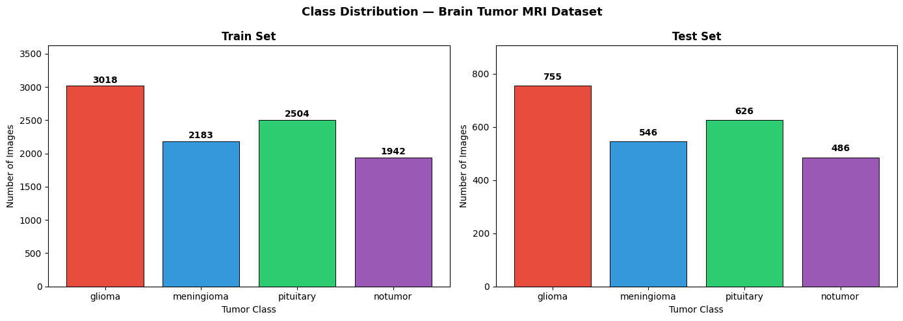
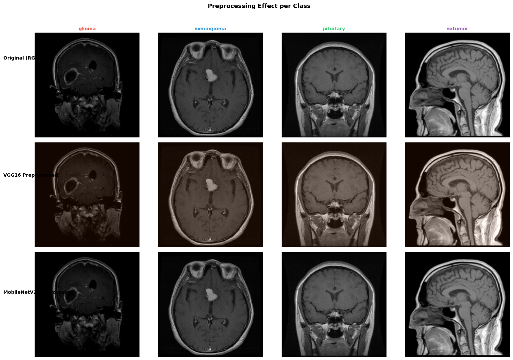
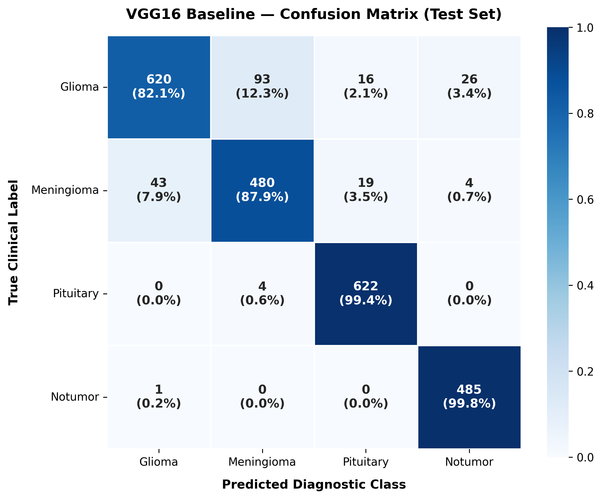
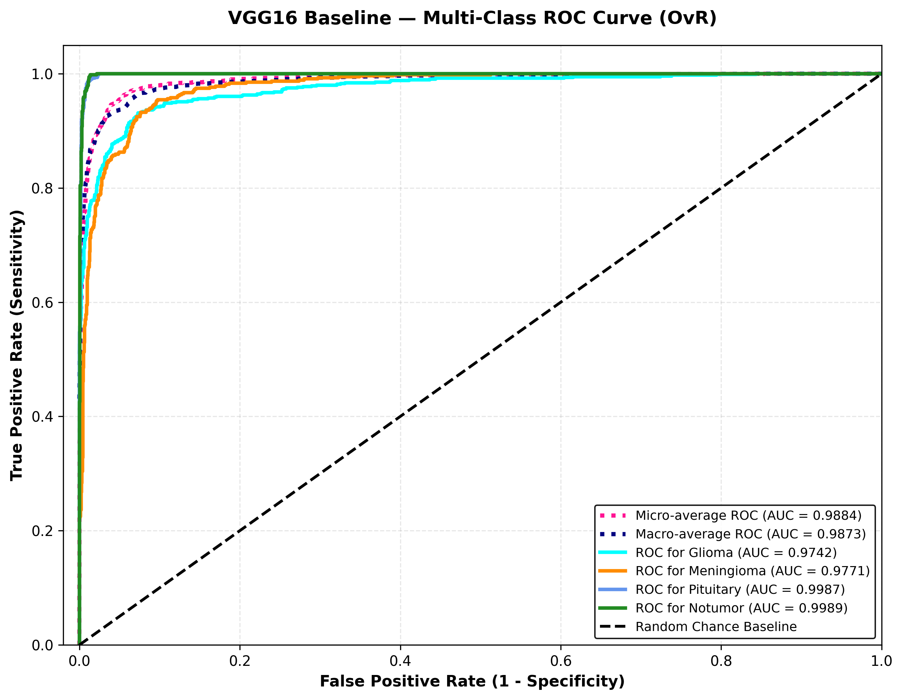
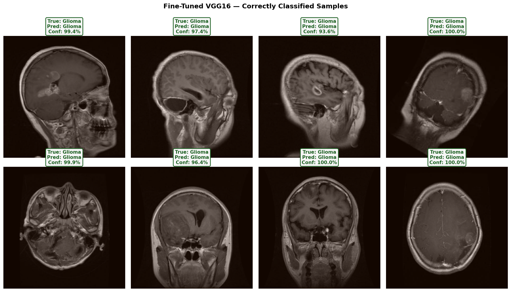
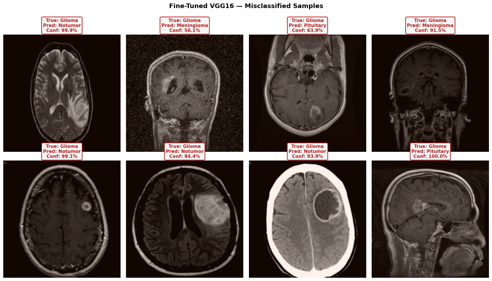

# Brain Tumor MRI Classification

## Overview
This repository contains an educational and research-focused deep learning project designed to build, evaluate, and optimize an end-to-end pipeline for classifying brain tumor magnetic resonance imaging (MRI) scans.

## Problem Statement
The objective of this project is to accurately classify 2D brain MRI slices into distinct diagnostic categories utilizing deep learning image classification architectures.

## Dataset
The project utilizes the "Brain Tumor MRI Dataset" containing image collections explicitly divided into predefined 'Train' and 'Test' subsets.

## Classes
The dataset is structured around four target classes:
- **Glioma**
- **Meningioma**
- **Pituitary**
- **Notumor**

## Methodology

### Data Preparation
The dataset is dynamically extracted and structured into a pandas DataFrame containing file paths, string labels, and split designations. A 10% stratified validation split is carved out from the training data to evaluate model generalizability during training while preserving class balance.

### Exploratory Analysis
Exploratory Data Analysis (EDA) mapped the class distributions to highlight dataset imbalances. Pixel intensity analysis was performed, confirming that while the MRI scans are strictly grayscale in nature, they were retained as 3-channel RGB to ensure compatibility with pre-trained ImageNet architectures. A "Mean Image Mosaic" was created to visualize the average spatial appearance of each class.

### Preprocessing
All MRI slices were uniformly resized to 224x224 pixels. Labels were one-hot encoded for Categorical Crossentropy, and computed balanced class weights were derived using `scikit-learn` to directly mitigate the class imbalance during model optimization. Dedicated preprocessing (e.g., VGG16 and MobileNetV2 scaling) was applied based on the underlying architecture.

### Augmentation
To prevent overfitting on the limited dataset, real-time data augmentation was applied via the TensorFlow data pipeline, including:
- Random left-right flips
- Random brightness adjustments (max delta = 0.15)
- Random contrast adjustments (0.85 to 1.15)

### Data Pipeline
The robust data ingestion pipeline leverages `tf.data.Dataset`. Parallel mapping (`tf.data.AUTOTUNE`) was utilized for image decoding and preprocessing. Strategic caching (post-resize, pre-augmentation), batching (size=32), and prefetching were implemented for optimal throughput.

## Model Development

### VGG16
A baseline model was built utilizing the pre-trained VGG16 backbone loaded with ImageNet weights. The core convolutional layers were strictly frozen (Feature Extraction). A custom classification head was attached consisting of GlobalAveragePooling2D, Dropout (0.3), a Dense layer (256 units, ReLU), Dropout (0.3), and a final Dense prediction layer (4 units, Softmax).

### MobileNetV2
An alternative, lightweight baseline was evaluated using MobileNetV2 (ImageNet weights, frozen backbone, Batch Normalization statistics locked). It utilized the exact same custom classification head as the VGG16 model to ensure a fair architectural comparison.

### Fine-Tuning
The VGG16 model was selected for further optimization. The deepest convolutional block (Block 5) was explicitly unfrozen to allow the network to adapt to domain-specific medical imaging features. The model was recompiled using the Adam optimizer with a micro-learning rate (1e-5) to prevent catastrophic forgetting.

## Results

The VGG16 Fine-Tuned model was selected as the final production artifact after significantly outperforming both standard baselines.

| Model | Test Accuracy | Macro Precision | Macro Recall | Macro F1-Score | Macro ROC AUC | Total Parameters |
| :--- | :--- | :--- | :--- | :--- | :--- | :--- |
| **VGG16 Baseline** | 91.46% | 0.9135 | 0.9230 | 0.9168 | 0.9873 | 14,847,044 |
| **MobileNetV2 Baseline** | 88.73% | 0.8866 | 0.8972 | 0.8896 | 0.9808 | 2,586,948 |
| **VGG16 Fine-Tuned (Winner)** | 96.35% | 0.9615 | 0.9667 | 0.9638 | 0.9959 | 14,847,044 |

## Visual Results

**1. Class Distribution**


**2. Data Augmentation Pipeline**


**3. VGG16 Baseline Confusion Matrix**


**4. VGG16 Baseline ROC/AUC Curve**


**5. Final Model Correct Predictions**


**6. Final Model Misclassifications (Error Analysis)**


## Gradio Demonstration
The final, optimized VGG16 architecture was deployed into a local Gradio interface. The interface successfully accepted raw 2D MRI slice uploads, dynamically applied the specific VGG16 scaling and resizing logic, and rendered real-time diagnostic probabilities across all four classes.

## Project Structure
```
.
├── docs/
│   └── project_overview.md
├── notebooks/
│   └── Brain_Tumor_MRI.ipynb
├── results/
│   ├── figures/
│   └── metrics/
├── .gitignore
├── LICENSE
├── README.md
└── requirements.txt
```

## Running the Project
This project was strictly designed for execution within a Google Colab environment.
1. Upload `notebooks/Brain_Tumor_MRI.ipynb` to Google Colab.
2. Mount your Google Drive to the runtime environment.
3. Ensure the source dataset is available in your designated Google Drive path.
4. Execute the cells sequentially.

## Limitations
- **Parameter Intensity**: The winning VGG16 architecture is highly parameter-heavy (~14.8M parameters), demanding a significantly larger memory footprint compared to architectures like MobileNetV2.
- **2D Slice Analysis**: The model is inherently limited to analyzing 2D independent slices. It is completely blind to the larger 3D volumetric context of an actual brain tumor structure.

## Future Work
- **3D Volumetric CNNs**: Transition away from 2D slices toward fully volumetric models (e.g., 3D ResNets) to capture multi-slice spatial features natively.
- **Semantic Segmentation**: Integrate models like U-Net to move beyond image-level classification into granular pixel-level localization and boundary mapping.
- **Multi-Modal Integration**: Expand the pipeline to ingest multiple concurrent MRI sequences (T1, T2, FLAIR) for a richer diagnostic feature set.

## Disclaimer
> **IMPORTANT:** This repository represents an educational and research-oriented deep learning project. It is **NOT** a clinical diagnostic system. The models, metrics, and outcomes discussed herein have not undergone medical validation, possess no regulatory approval, and must absolutely never be used to facilitate actual medical diagnoses or clinical decisions.
